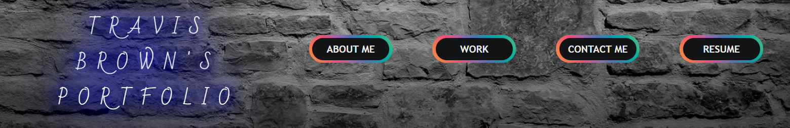

<!--  -->

  

  
  
  
      
     
    

<h1 align="center">
  Hey there
  
</h1>

Welcome to my GitHub page! My name is Travis Brown and I am a full-stack developer , certified through the University of Kansas Bootcamp program.

Feel free to browse my work and my portfolio. If you have any questions, reach out to me and I will answer you as soon as I can!

---

### ⚡ About Me:
- :computer: Full-Stack Developer Graduate August/2021
- :dog: Maple is my furry friend (Mini-Golden Doodle)
- :football: Former D-I College Football Coach-ACU
- 🔭 I’m currently learning: Javascript, React, MongoDB, Handlebars
- 🎮 I'm a Xbox Video Gaming Nerd (Madden/COD/NBA2k/RDR2)
- 💬 [Email Me for any questions!](mailto:bergannation@gmail.com)

---

### :hammer_and_wrench: Languages and Tools :

  &nbsp;
  &nbsp;
  &nbsp;
  &nbsp;
  &nbsp;
  &nbsp;
  &nbsp;
  &nbsp;
  &nbsp;
  &nbsp;
  &nbsp;
  

---

### :fire: My Stats :

## 💾 Portfolio:

- [Travis Brown's Portfolio](https://bergannation.github.io/20_ReactPortfolio/)

 

<h4 align="center">
    
    
    
    
    
    

</h4>
